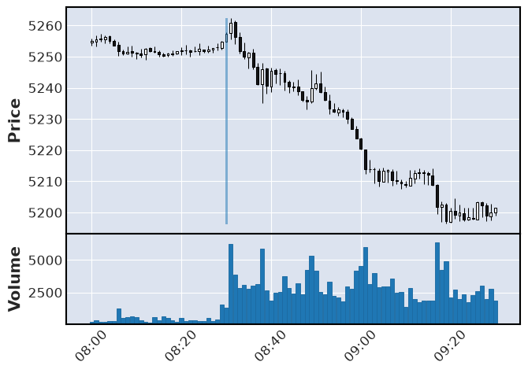
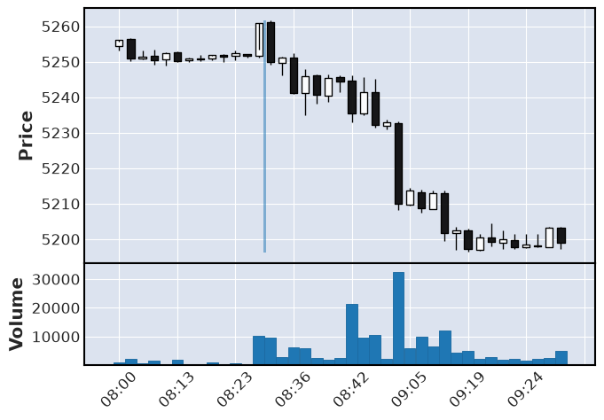

# Futures Market Data Pipeline and Warehoue
This project builds an automated, end-to-end data pipeline to process daily e-commerce transactions and regional inventory logs. The goal is to eliminate manual reporting silos and provide a unified, highly available data model that powers an executive dashboard for tracking daily revenue, identifying low-stock items, and analyzing regional sales trends.

## 📖 Overview
This project builds a data pipeline to ingest and process Ninja Trader's 
historical market data , specifically for the E-Mini S&P. The goal is to create 
a data pipeline that automates (to an extent) the ingestion and processing of 
futures market data for technical analysis / strategy development into a 
data warehouse.

## 🛠️ Technologies Used
- **Language:** Python
- **Data Warehouse:** PostgreSQL
- **Data Processing:** Pandas, DBT
- **Orchestration:** Apache Airflow
- **Containerization:** Docker, Docker Compose
- **BI / Visualization:** Jupyter Notebooks


## 📊 The Dataset
- **Source:** Ninja Trader Historical Minute Market Data
- **Description:** Each contract has about 80k records, contracts last ~4 months
- **Row Sample**: 20200101 230100;3237;3238;3235.25;3236.25;2974
- **Data Dictionary:**
  | Column Name | Data Type | Description |
  |-------------|-----------|-------------|
  | `bar_timestamp`     | String    | Primary key |
  | `open=_price`    | String     | Metric recorded |
  | `high_price`    | String   | Primary key |
  | `low_price`     | String   | Primary key |
  | `close_price`   | String   | Primary key |
  | `volume`        | String   | Primary key |


## 🏗️ Architecture & Data Flow

1. **Gathering**: Ninja Trader offers free historical data, however limits it
to only the downloaded application, where you have to manually download the CSV.
To Automate this, `es-pipeline/scripts/get_hisorical_data.py` is ran to download
data by contract.
2. **Extraction**: The CSV files land into a `es-pipeline/data/landing`, where a
script is ran to extract the data into the bronze layer of a Postgres Instance.
Data is stored raw into the bronze layer of a Postgres Database. Additionally
NYSE date data is extracted from a restAPI called "pandas_market_calendars".
4. **Transformation**: DBT is used to clean, normalize, and standardize the
bronze layer to the silver. A python script is used to group the silver layer
data into "legs" or bars that move in the same direction in a single move.
5. **Orchestration**: Airflow Schedules the calendar data every year, while
market data must be triggered manually. However, Airflow does detect if there
is a file in the dedicated landing folder, before initating the pipeline.
6. **Analysis**: Performed EDA on data to find simple patterns / validate claims
using juypter notebooks interactivity and matplotlib for visualization.


## 🔄 Transformation Logic (dbt / python)
Transformations are handled using dbt and pandas, moving data through a 
Medallion Architecture to ensure data quality and traceability.

### 🥉 Bronze Layer (Raw Data)
*   **Ingestion:** Raw CSV Files from
*   **Logic:** No transformations applied. Data is stored as `VARIANT` (JSON) 
or raw text to maintain a strict historical record.

### 🥈 Silver Layer (conformed)
*   **Type Casting:** Convert timestamp column into Date Time then converted to 
Chigago TZ, and converted all values to numeric
*   **Standardization:** Renamed Columns
*   **Extra:** Ninja Trader Data is pretty clean, performed EDA and found 
no dupes or nulls

### 🥇 Gold Layer (Aggregated for Potential Strategies)
*   **legs**: Applies custom logic to group bars going in the same direction 
into a single bar

## Analysis 
Exploratory Data Analysis Performed on the prepared dataset.

### archived_notebooks
A folder containing all the old EDA's that dont apply to the analysis 
See [archived_notebooks](../analysis/archived_notebooks)

### 01_Leg_Anlaysis.ipynb
Performs Analysis on gold.es_legs, with the goal of validating the claim that
4 point moves are a viable target. Explores magnitude, time, durration, drawdown,
volume, ect. See [01_leg_analysis.ipynb](../analysis/notebooks/01_leg_analysis.ipynb)

### chart_visualization.ipynb
Visualize charts for logic testing of legs function and exploration.




## ⚙️ Prerequisites
Before running this project, ensure you have the following installed:
- [Docker & Docker Compose](https://www.docker.com/)
- Have a Ninja Trader Account with the Ninjatrader App + ES Contracts downloaded (on app)
- Postgres and pgAdmin Installed, with database ready for use


## 🚀 Setup and Installation

**1. Clone the repository**
```bash
git clone [https://github.com/dogaha/technical-analysis.git](https://github.com/dogaha/technical-analysis.git)
cd technical-analysis
```
**2. Setup**
1. Fill out Env file
```.env.example
# Airflow 
AIRFLOW_UID=[AIRFLOW_UID]
FERNET_KEY=<generate one>
AIRFLOW_PROJ_DIR=./airflow
AIRFLOW_CONN_FS_DEFAULT=file://

# DBT Postgres Data
POSTGRES_USER=[POSTGRES_USER]
POSTGRES_PASSWORD=[POSTGRES_PASSWORD]
POSTGRES_DB=[POSTGRES_DB]
```

2. Run [init.sql](es-pipeline/scripts/init.sql) in PGadmin

**2. Download Data**
1. Open Ninja Trader App
2. Open Simulation or Live 
3. Go to Tools
4. Go to Historical Data
6. Edit year range in [get_historical_data.py](es-pipeline/scripts/get_hisorical_data.py)
``` bash
docker compose exec /scripts/get_historical_data.py
```
Run the [get_historical_data.py](es-pipeline/scripts/get_hisorical_data.py)
```get_historical_data.py
...

start_year = 2024
end_year = 2025

...
```

**3. Trigger Dags**
1. Trigger [calendar-pipeline_ingestion.py](es-pipeline/airflow/dags/calendar-pipeline_ingestion.py) dag 
2. Trigger [calendar-pipeline_ingestion.py](es-pipeline/airflow/dags/es-pipeline_ingestion.py) dag

**4. Notebooks**
1. Run Notebooks / create new notebooks / Pipeline is finished

